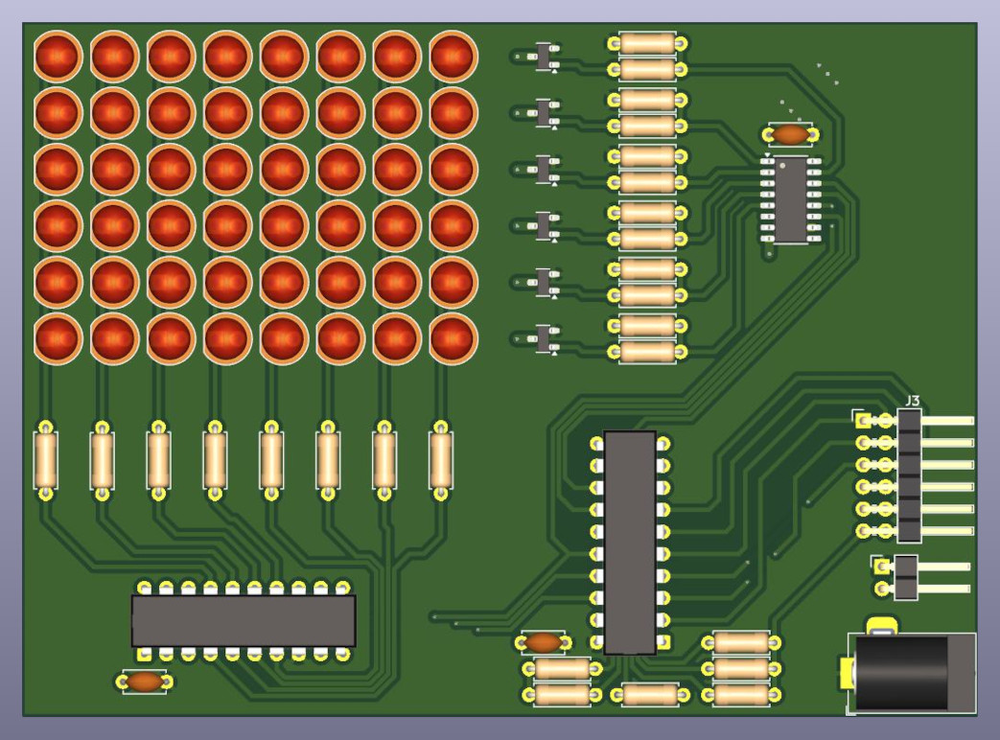
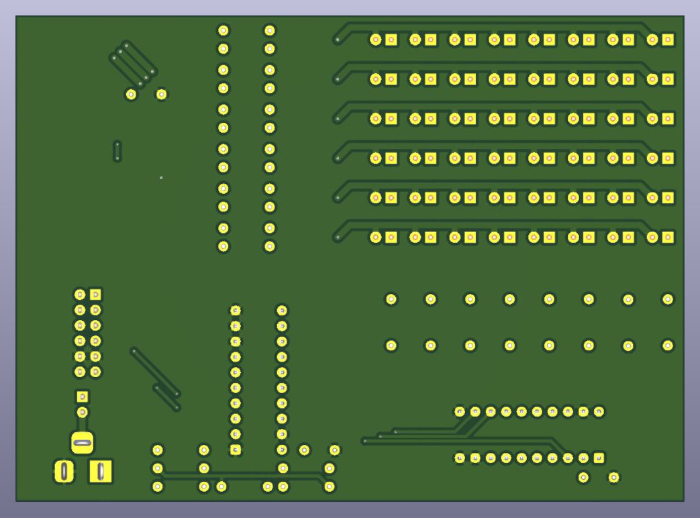
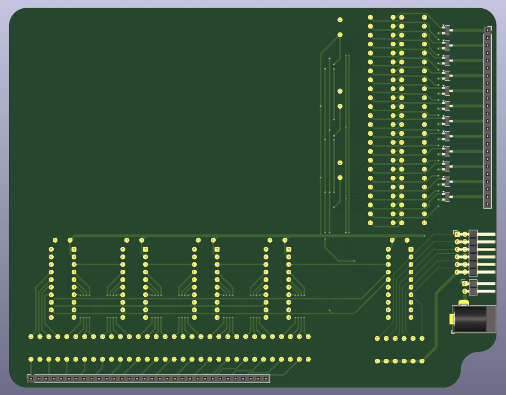

# KiCAD PCBs Documentation

This document will give you an overview of the project's schematics and PCBs.

> Note: While you'll find the general description and idea behind the PCBs here
> the more technical details are contained within the schematic files themselves.


## Navigation

1. [KiCAD Specifics](#kicad-specifics)
2. [General overview and considerations](#general-overview-and-considerations)
3. [Small LED Board](#small-led-board)
   1. [v1 - Proof of Concept](#v1---proof-of-concept)
   2. [v2 - Improvements and Fabrication](#v2---improvements-and-fabrication)
4. [Fullsize LED Board](#fullsize-led-board)
   1. [Display PCB](#display-pcb)
   2. [Driver PCB](#driver-pcb)


## KiCAD Specifics

The project files have been developed with KiCAD version 9.0. Make sure you're on
the same or a later version otherwise the files may not work correctly.

Custom symbols for specific parts have been included in a local symbol and footprint
library. Some symbols have a corresponding symbol in the KiCAD base libraries but
these weren't available during the initial development with KiCAD 8.0.
Since these do not fit the used parts exactly, I simply kept the custom symbols.


## General overview and considerations

There are two different main KiCAD projects. One is the "Small LED Board" and
the other one is the "Fullsize LED Board". The first was developed as the
prototype while the latter was the final design.
All boards require the same 5V operating voltage. The beefier fullsize board
requires a 5V/2A supply to operate properly as its current draw can spike over
1A.

Both boards have been designed with the [project's media constraints](media.md#goals) in mind
and work by multiplexing the LED matrix.
It is important to note that, while these designs certainly work within the constraints
they could be improved substantially with component selection and more importantly
PCB layouting. However, since the goal of this project is more FPGA related rather
than schematics design and PCB routing, the boards are - for this case - 'good enough'.

The most critical point of these designs is the row data line for the
column shift registers as it is the line that toggles the most almost as often as
the board's clock.
An explanation on how these boards actually display video data can be found
in the [HDL docs](hdl.md#board-driver).
While the actual board clock is slightly higher, the most straight forward estimate
can be done with the formula:
```
ClockRate = WIDTH * HEIGHT * BRIGHTNESS LEVELS * STROBES PER FRAME * FRAMES PER SECOND
```

Plugging in the values for the small and fullsize LED boards yield these results:
```
ClockRate (8x6) = 8 * 6 * 16 * 4 * 24 ~ 75 kHz
ClockRate (32x24) = 32 * 24 * 16 * 4 * 24 ~ 1.2 MHz
```

These numbers aren't unreasonably high, but the fullsize board barely manages them.
Increasing the strobe frequency from 4 to 5 causes the display to barely work, and
values beyond that are simply not possible due to the bad PCB traces and missed
impedance matching and long cables/traces.


## Small LED Board

This smaller board (8x6) was developed as a working prototype to get a feel
on the actual hardware. Its main goal was to test the functionality of the design
and see if it would be working as intended.

### v1 - Proof of Concept

This iteration uses regular 74HC595 shift registers to control the anode
and cathode MOSFETs. While the IRLZ44N does its job remarkably well,
the IRF4905 is not particularly suited for this application due to the 5V
input voltage.

<div align="center">
    
    <br>
    KiCAD 3D Render of the Small LED Board v1
</div><br>

<div align="center">
<details>
    <summary>Bill of Materials - click to open</summary>

| Type             | Component Name | Amount |
| ---------------- | -------------- | ------ |
| LED              | QUAD 1802O025  | 48     |
| N-channel MOSFET | IRLZ44N        | 14     |
| P-channel MOSFET | IRF4905        | 6      |
| Shift IC         | 74HC595        | 3      |
| Resistor         | 66 Ω, 1/4 W    | 8      |
| Resistor         | 1k Ω, 1/4 W    | 26     |
| Pin Socket       | 2x4 2.54mm     | 1      |
| Power Input      | Barrel Jack    | 1      |

</details>
</div>

The shift registers are driven by the FPGA through logic-level-shifter transistors.
Supplying a logic '1' (3.3V) to the gate of the transistor drives the shift regiters'
pins actively low while supplying a logic '0' (0V) causes the transistor
to stop conducting and the input of the shift register to charge up through the
1K pull up resistor.

Due to the gate characteristics of the IRL44N it is possible to safely drive
a Vds=5V with only Vgs=3.3V. Unfortunetaly the IRF4905 struggles quite a bit
with that and requires Vgs=5V to turn on/off with a tolerable voltage drop.

Apart from these considerations the board is relatively unspectacular and
was put together on a veroboard somewhat quickly. Testing it however
yielded interesting results:

- **Pull-Up Resistors:** Using these to drive the inputs of the shift registers high
  turned out to be way too slow. They take a few microseconds to charge up and
  considering the target clock frequency of the fullsize board, this would
  require very low pullups resulting in excess power draw.
- **Backwards Clock Wiring:** The SCK/RCK lines of the shift registers are
  connected in reverse to deal with the potential skew of the very long
  transmission lines on the fullsize board. This works very well.
  This is also the main reason why there are two row selection shift registers
  even though one would have sufficed.
- **IRF4905:** Being a popular and widely available P-MOSFET, it is
  unsuitable for the final board and should be switched out.

> Note: While this board was layed out on a PCB as practice, it was actually never
sent to production for fabrication. It was only soldered on a veroboard and that
quite badly.


### v2 - Improvements and Fabrication

With the knowledge in hand from the first iteration, the second version tackles
the shortcomings of the first one.

<div align="center">
    
    <br>
    KiCAD 3D Render of the Small LED Board v2
</div><br>

<div align="center">
<details>
    <summary>Bill of Materials - click to open</summary>

| Type             | Component Name | Amount |
| ---------------- | -------------- | ------ |
| LED              | QUAD 1802O025  | 48     |
| P-channel MOSFET | SQ2351CES      | 6      |
| Buffer IC        | 74HCT541       | 1      |
| Shift IC         | 74HCT595       | 1      |
| Shift IC         | TPIC6B595N     | 1      |
| Capacitor        | 100 nF         | 3      |
| Resistor         | 1M Ω, 1/4 W    | 12     |
| Resistor         | 150 Ω, 1/4 W   | 6      |
| Resistor         | 56 Ω, 1/4 W    | 8      |
| Pin Header       | 1x2 2.54mm     | 1      |
| Pin Header       | 2x5 2.54mm     | 1      |
| Power Input      | Barrel Jack    | 1      |

</details>
</div>

The shift registers for the column selection along with the MOSFETs were
switched out with a open-drain power shift register TPIC6B595N. Unlike the
74HC595 it can sink substantially more current which allows us to remove
the cathode MOSFETs.

Replacing the row selection shift registers with their CMOS-variant (74HCT595)
allows for fasting switching speeds and a smaller footprint. These registers
now drive a SQ2351CES P-MOSFET which has better Vgs characteristics
compared to the IRF4905. The gate resistor has been lowered to 150 Ohms
to allow for faster switching and a 1 Megaohm pull-up has been inserted
to keep the gate from floating during power up.

Since the logic-level-shifters with the IRLZ44N and the 1K pull-ups was too slow
a 74HCT541 buffer was inserted to convert the 3.3V voltage levels from the FPGA
to the desired 5V input voltage of the other ICs. Its inputs are also secured with
high resistance pull-ups.
All ICs have received a 100nF decoupling capacitor to ensure smooth operation
during voltage and current transients.

This board was sent off to fabrication and tested successfully. It achieved
around 2.5MHz safely on the fastest line to toggle which exceeds the
targeted specification of the fullsize board.

> Note: This board performs much better regarding the maximum clock rate as the
> pcb transmission lines are physically much shorter and don't get effected by
> reflections too much.


## Fullsize LED Board

Having gone through the two iterations of the smaller board it is time to
design the fullsize board. For the visual appeal, this version will be split
onto two different PCBs, one containing all the LEDs as a screen,
and another containing all the relevant driving circuit hidden beneath
the big screen PCB.

Two pin headers on the display and the corresponding sockets on the driver PCB
will hold the assembly together. The rounded bottom right corner on the driver PCB
provides enough space for the mounting screw (to lift the assembly off the ground).

### Display PCB

For the display there's nothing much to say because it's simply just the same LED matrix
from the smaller board but scaled up from 8x6 to 32x24. Pin headers poking out the back
are used to access each row and column of the LEDs. Dedicating a whole PCB just for the display
and having a row-column interface allows this matrix to be used for other projects aswell.

<div align="center">
    
    <br>
    KiCAD 3D Render of the Fullsize LED Board Display
</div><br>

<div align="center">
<details>
    <summary>Bill of Materials - click to open</summary>

| Type       | Component Name | Amount |
| ---------- | -------------- | ------ |
| LED        | QUAD 1802O025  | 768    |
| Pin Socket | 1x32 2.54mm    | 1      |
| Pin Socket | 1x24 2.54mm    | 1      |

</details>
</div>

The header on the right side is used to select a row and connects to the LED anodes, while
the header on the bottom is used to select the columns and connects to the LED cathodes.

### Driver PCB

Even though all driver related components are moved to a different PCB, the overall layout
remains pretty much the same concentrating all ICs in the bottom right corner.

<div align="center">
    
    <br>
    KiCAD 3D Render of the Fullsize LED Board Driver
</div><br>

<div align="center">
<details>
    <summary>Bill of Materials - click to open</summary>

| Type             | Component Name | Amount |
| ---------------- | -------------- | ------ |
| P-channel MOSFET | SQ2351CES      | 24     |
| Buffer IC        | 74HCT541       | 1      |
| Shift IC         | 74HCT595       | 3      |
| Shift IC         | TPIC6B595N     | 4      |
| Capacitor        | 100 nF         | 8      |
| Resistor         | 10k Ω, 1/4 W   | 30     |
| Resistor         | 150 Ω, 1/4 W   | 24     |
| Resistor         | 20 Ω, 1/4 W    | 32     |
| Pin Header       | 1x2 2.54mm     | 1      |
| Pin Header       | 2x5 2.54mm     | 1      |
| Pin Socket       | 1x32 2.54mm    | 1      |
| Pin Socket       | 1x24 2.54mm    | 1      |
| Power Input      | Barrel Jack    | 1      |

</details>
</div>

A design quirk of this stacked/dual PCB approach is that the view on the left (front) is what you'd see through the LED matrix. Turning around the whole assembly reveals the picture
on the right (back) with the components facing the table. This has been done to be
able to view the parts without having to disassemble the long fragile headers.

Both the power supply connectors (the barrel jack and the two-pin header) and the header
for the driver signals remain on the front side so the board doesn't gain more height and
the screws through the display PCB can stay reasonably short.

There are no design changes compared to the v2 iteration of the smaller board. Everything
has been scaled up to match demands. Even though the signal paths are much longer than those
found on the smaller boards, the driver can still operate fast enough to match the constraints.
This is quite fortunate because there is no impedance matching for any of the traces.

For example, the SCK and SRCLK are connected backwards to eliminate the possibility of the
a shift register to shift out its contents before the next one has latched the previous
(correct) bit. In the case of the columnn shift registers this line is almost 20 cm long
which results in terrible reflections and ringing (overshooting/undershooting) during a
voltage level transition.

Designing this board adequately with the proper PCB design techniques - such as impedance
matching - would yield much greater performance. As stated previously, the focus on this
project is on the FPGA side of things and it should come as no surprise to see beginner
mistakes on a beginner PCB. :^)

Due to the split PCB approach, a big chunk of the driver PCB remains unpopulated with
components or traces. This could be carved out leaving the driver in a sort of L-shape
but was kept there for physical stability. It also works perfectly for some project
information and advertising one's github profile.
