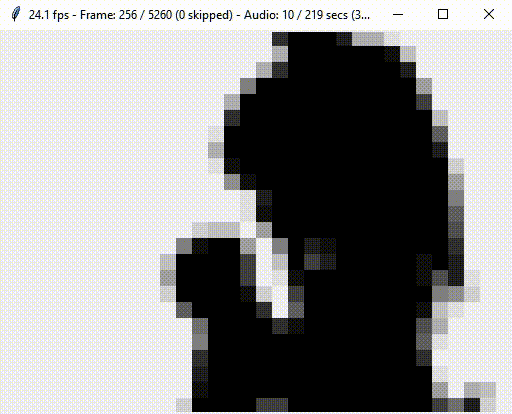

# Python Scripts Documentation

This readme will guide you through the steps necessary to set up and run the python scripts.


## Navigation
1. [Requirements](#requirements)
2. [Setting up the virtual environment](#setting-up-the-virtual-environment)
3. [Encoding media files into the project format](#encoding-media-files-into-the-project-format)
4. [Playing the encoded media in a software player](#playing-the-encoded-media-in-a-software-player)
5. [Appending the media onto a FPGA bitfile](#appending-the-media-onto-a-fpga-bitfile)


## Requirements

- Python >= 3.8
- Pip Modules (requirements.txt):
  - pillow >= 10.2.0
  - PyAudio >= 0.2.14
  - pyffmpeg >= 2.4.2.18.1


## Setting up the virtual environment

Using pip and venv is recommended for setting up an environment where these scripts can run.
You could install the packages globally, but that will clutter your system.

Follow these steps to create the environment:

1. Open a terminal and switch into the `python`-folder
2. Create a virtual environment with `python -m venv .venv`
3. Activate the virtual environment in your current shell/terminal
   - Linux: `source .venv/bin/activate`
   - Windows: `.venv\Scripts\activate.bat`
4. Install the necessary modules by running `pip install -r requirements.txt`

That's it! Make sure to always activate the environment first before running the scripts.

> Note: Linux users may have to install the `python3-venv` package in order to create a
> a virtual environment and `python3-tk` to run the player script which uses tkinter for the GUI.


## Encoding media files into the project format

`convert.py` takes care of the media encoding and is controlled by supplying command line arguments.
An overview of the possible arguments can be displayed by just calling the script or
with the `--help` flag and looks like this:

<details>
<summary>convert.py help - click to open</summary>

```
usage: convert [-h] -i INPUT [-o OUTPUT] [-r RESOLUTION]

Encodes a given media file to the project's media format.

The file is pre-processed by ffmpeg and as such all
audio and video formats supported by ffmpeg are usable.

Output quality will be fixed:
  Video: 32:24 (default) at 24 fps
  Audio: 1 channel with 4 bit per Sample at 44.100 Hz

options:
  -h, --help            show this help message and exit
  -i INPUT, --input INPUT
                        Input media file
                        If a WAVE file is passed (.wav) then the video will be left out.
  -o OUTPUT, --output OUTPUT
                        Output encoded file
  -r RESOLUTION, --resolution RESOLUTION
                        Target resolution in w:h.
                        (default: 32:24)
```

</details><br>

Encoding a file that is located at `media/demo.mp4` to 8x6 resolution (small LED board) is done like this:<br>
```console
python convert.py -i media/demo.mp4 -o media/demo.bin -r 8:6
```

> Note: If you don't supply an output file path the encoded file will be discarded
> and only the encoding statistics will be printed.

After the encoding process is done you will see information about the achieved compression in the terminal.

<details>
<summary>convert.py output example - click to open</summary>

```
=================== File Information ===================
Input:              media/video.mp4
Size:               19126 K
Output:             media/video.bin
Resolution:         32:24
========================================================

================== FFmpeg Processing ===================
Pre-processing input file...done!

Audio stream detected.
Video stream detected.
========================================================

=================== Audio Processing ===================
Reading audio file...done!
Encoding audio...done!

Uncompressed Size:  37748 K
Reduced Size:       4718 K
Encoded Size:       2467 K (52.29%)
========================================================

=================== Video Processing ===================
Reading video frames...done!
Encoding video...done!

Uncompressed Size:  11835 K
Reduced Size:       1972 K
Encoded Size:       760 K (38.54%)
========================================================

======================= Summary ========================
Writing output file...done!

Uncompressed Size:  49583 K
Reduced Size:       6691 K
Encoded Size:       3227 K (48.24%)
========================================================
```

</details><br>

The script outputs three size metrics for the audio and video encoding process:
- Uncompressed: Size of the **raw data** in its uncompressed form
- Reduced: Size of the **raw data after downscaling** to the target quality
- Encoded: Size of the **encoded reduced data** with the compression ratio in comparison to the reduced size


## Playing the encoded media in a software player

A software player is included with `player.py` to playback encoded media files without having
to build a LED board first. This is also helpful if you want to test the output file before
going through the tedious process of bringing it onto the flash memory of the FPGA.

<details>
<summary>player.py help - click to open</summary>

```
usage: player [-h] -i INPUT [-b BLOCKSIZE]

Plays a file that was encoded in the project's media format.

Press [Space] to pause and [m] to mute.

options:
  -h, --help            show this help message and exit
  -i INPUT, --input INPUT
                        Input media file
  -b BLOCKSIZE, --blocksize BLOCKSIZE
                        Scales a pixel by this amount for a bigger preview window.
                        (default: 32)
```

</details><br>

It is pretty self explanatory. You can playback a file at `media/demo.bin` like this:
```console
python player.py -i media/demo.bin
```

After a small amount of time to decode the file (check the console), the player will show up:
<div align="center" style="font-size: 12px;">
    <br>
    Clip Source: <a href="https://www.nicovideo.jp/watch/sm8628149">[Touhou] Bad Apple!! PV [Shadow]</a>
</div><br>

You can pause/play by pressing [Space] and mute/unmute the audio by pressing [m].

## Appending the media onto a FPGA bitfile

In order not to flash the FPGA with the bitfile every time you want to play something from memory
you can store the bitfile in the flash chip aswell. This way the entire project can be run
without the need of a PC by preloading the flash with the project and media files.

The <a href="https://digilent.com/reference/programmable-logic/basys-3/reference-manual#fpga_configurations">Basys3 Reference Manual</a>
states that the uncompressed bitfile can be 17,536,096 bits (2,192,012 Bytes) which is pretty much spot on
to the size of the actual uncompressed implementation of 2,192,124 Bytes of which we'll use the latter.

Since the bitfile needs to be stored at the beginning of the flash when choosing to boot over QSPI, we can assume
for the first 2172FCh Bytes to be the bitfile. We can start our mediafile after this offset but should add a small offset
on top just to be safe.

> Note: This project still compresses the bitfile to save some time, using the additional space gained from compression
> to put the media at an earlier offset has not been tested.

I picked 21800h for my media file which leaves me with a little bit over 2 MB of space. That offset has to be wired
into the top level entitiy as the media base address generic, otherwise it'll look at the default location (0).

> Note: While there is no mechanism implemented to scan through the flash chip for media files
> this can be implemented without too much effort.

`concat.py` can be used to glue the bitfile and mediafile together. It can also concatenate two arbitrary files
but the semantics are described for the FPGA bitfile and an encoded mediafile.

<details>
<summary>concat.py help - click to open</summary>

```
usage: concat [-h] -i INPUT -m MEDIAFILE [-p POSITION] -o OUTPUT

Concatenates two binary files together with an offset.

options:
  -h, --help            show this help message and exit
  -i INPUT, --input INPUT
                        Input fpga bitfile (or already concatenated binfile)
  -m MEDIAFILE, --mediafile MEDIAFILE
                        Mediafile to append after the bitfile or at a specific index.
  -p POSITION, --position POSITION
                        Place the mediafile at this byte position (decimal or hex).
                        Existing data will not be overwritten.
                        (default: append after input file)
  -o OUTPUT, --output OUTPUT
                        Output binfile that contains both files.
```

</details>

All that's left is to call the script (after implementation) and place the mediafile at the given offset like this:
```console
python concat.py \
    -i ../vivado/fpga-mediaplayer.runs/impl_1/fpga-mediaplayer.bit \
    -m media/demo.bin \
    -p 0x21800h \
    -o media/combined.bin
```

The output file can be used to program the onboard flash and boot the board over QSPI which is explained
in the README.md of the vivado subfolder.
